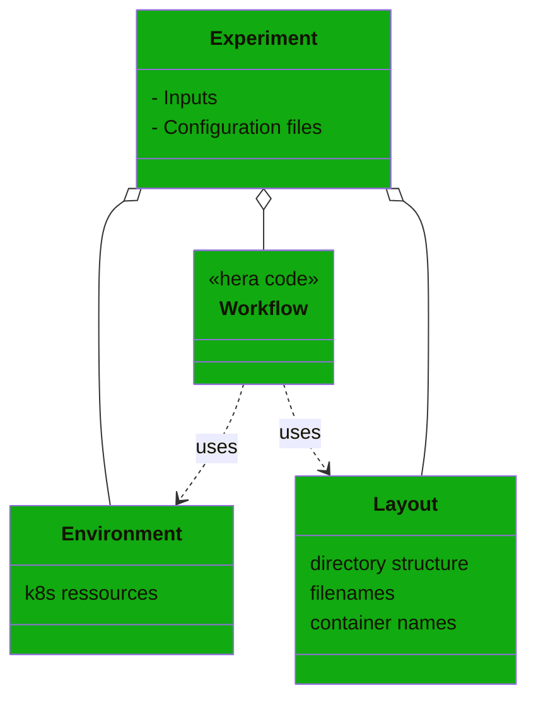
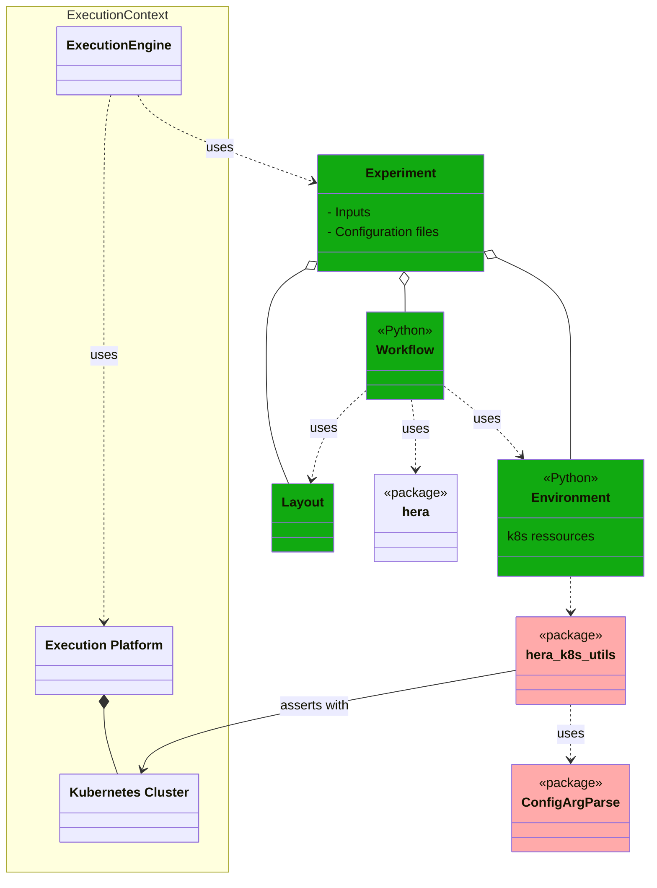
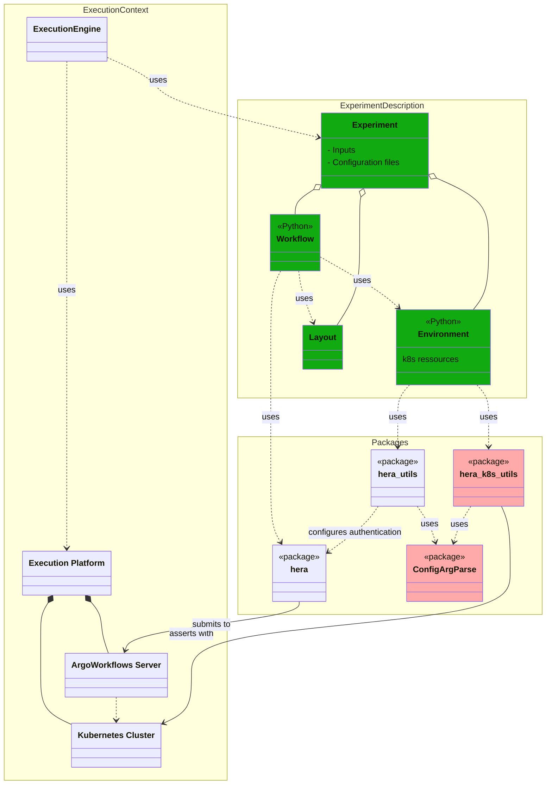

# hera_k8_utils: an embryonic python library of Hera workflows utilities<!-- omit from toc -->

## Table of contents<!-- omit from toc -->

- [Introduction](#introduction)
- [Proposed organizational structure](#proposed-organizational-structure)
- [Executing the Experiment](#executing-the-experiment)
- [Combining `hera_utils` with `hera_k8s_utils`](#combining-hera_utils-with-hera_k8s_utils)
- [What `hera_k8_utils` should help you set up: a functional description](#what-hera_k8_utils-should-help-you-set-up-a-functional-description)
- [A more complete example](#a-more-complete-example)
- [Configuring `hera_k8s_utils`](#configuring-hera_k8s_utils)
  - [Retrieve your Kurbenetes cluster credentials (for CLI usage)](#retrieve-your-kurbenetes-cluster-credentials-for-cli-usage)
  - [Choosing a mode of persistence for you servers environment variables](#choosing-a-mode-of-persistence-for-you-servers-environment-variables)
  - [hera\_k8\_utils configuration through environment variables](#hera_k8_utils-configuration-through-environment-variables)
  - [hera\_k8\_utils configuration through CLI flags/arguments](#hera_k8_utils-configuration-through-cli-flagsarguments)
  - [hera\_k8\_utils configuration through a configuration file](#hera_k8_utils-configuration-through-a-configuration-file)
- [Using (hera with) hera\_k8s\_utils](#using-hera-with-hera_k8s_utils)
  - [`hera_k8_utils` package installation](#hera_k8_utils-package-installation)
  - [Configure hera\_k8s\_utils and assert that configuration (run some tests)](#configure-hera_k8s_utils-and-assert-that-configuration-run-some-tests)
  - [Run the examples](#run-the-examples)
- [For developers](#for-developers)
  - [Setting up the development context](#setting-up-the-development-context)
  - [Some notes](#some-notes)


## Introduction

`hera_k8s_utils` is a Python package that

1. proposes a simple/direct **organizational structure** for numerical experiments scripts based on [hera (workflows)](https://github.com/argoproj-labs/hera),
2. facilitates the description of the **[k8s](https://en.wikipedia.org/wiki/Kubernetes) ressources/dependencies** on which such an [`hera` script](https://github.com/argoproj-labs/hera) relies.

`hera_k8s_utils` comes in complement of the [`hera_utils`](https://github.com/VCityTeam/hera_utils/blob/master/README.md) package (that focuses on the Argo Server part) in order to facilitate the abstraction/separation of [an hera based script](https://github.com/argoproj-labs/hera) from the concrete servers that shall be used to run them.

## Proposed organizational structure

The expression of an `hera_k8_utils` based numerical experiment script, uses the underlying organizational structure of the `hera_k8_utils` package. This structure boils down to a comment of the following diagrams



It is thus proposed to structure the description of a (numerical) **experiment** (more generally a set of jobs) on top of the following separated concerns:

- (the experiment) **inputs**: what concrete set of parameters should be used,
- (the experiment) **layout** (naming convention, organizational structure) of its inputs/outputs: where (in which file, directory, database...) does each task take its (file) inputs from and where does that task store its outputs to (and how does it name them)
- the **environment** (of execution of the experiment) that is the set of resources required for the execution of the experiment. T  e.g. a [persistent volume](https://kubernetes.io/docs/concepts/storage/persistent-volumes/), a container registry...
- as set of **configuration files** describing the serialization of the environment of execution,
- eventually a [**workflow**](https://en.wikipedia.org/wiki/Scientific_workflow_system) that expresses the specific set atomic computations (tasks) that should be realized and their possible organization (as expressed with the [`hera` workflows language](https://github.com/argoproj-labs/hera)). The workflow description is itself based on the experiment layout and environment.

## Executing the Experiment

Once given (the description of) an Experiment, one uses an `execution engine` in order to proceed with its realization. When executing an Experiment, the ExecutionEngine will

1. [provision](https://en.wikipedia.org/wiki/Provisioning) a concrete instance of the Environment (of execution as opposed to the environment of submission),
2. launch the computations (most often) by delegating/submitting the Workflow to some Argo Server. The set of information required for that execution is gathered within an Environment that will use `hera_k8s_utils` for its description.

The execution engine will thus use the "data model" proposed by a `hera_k8s_utils` Experiment



## Combining `hera_utils` with `hera_k8s_utils`

When describing an Experiment one needs to simultaneously define the both aspects of its Environment:

- the **environment of execution** for which one can use the `hera_k8s_utils` package
- the **environment of submission** for which one can use the [`hera_utils` package](https://github.com/VCityTeam/hera_utils/).

The integrated resulting structure of the Experiment is depicted by the following diagram



## What `hera_k8_utils` should help you set up: a functional description

Under the hood hera_k8_utils allows for the following definitions

```python
import hera_k8_utils

# Make sure that all the elements of the HERA context can be extracted from either
# the Command Line Arguments (CLI), the environment variables or the configuration
# files:
args = hera_k8_utils.parser().parse_args()    

# Define a (basic/simple) Environment
environment = hera_k8_utils.num_exp_environment(args)

# Note: the constructor num_exp_environment(args) asserts both that
#  - the argo server (to be used for workflow submission)
#  - the k8s cluster (where some ressources were defined)
# are accessible by calling
#      cluster = hera_k8_utils.cluster(args)
```

Your Python script (more precisely, your Experiment expressed as a Python script) can define

- its own environment (though derivation of `hera_k8_utils.num_exp_environment`)
- its inputs,
- its layout

```python
import hera_k8_utils

args = hera_k8_utils.parser().parse_args() 

# The environment is based on hera_k8s_utils.num_exp_environment
from my_environment import environment 
environment = environment(args)

from my_specific_input import inputs

from my_experiment_layout import experiment_layout
layout = experiment_layout(args, inputs.constants)
```

Eventually your Experiment will define the Workflow code with the help of the Hera library package on top of the environment, input and layout variables

```python
define_hera_workflow(environment, input, layout)   # Uses hera.workflows
```

## A more complete example

The following example slightly complements the usage of `hera_k8_utils` by providing a Workflow
(refer to [`examples/volumes` example](./hera_k8s_utils/examples/volumes/) for the full examples)
together with some more detailed comments

```python
if __name__ == "__main__":

    # Retrieve the parsed CLI arguments and/or environment variables (of the Python script)
    # and/or the configuration files that designate (and provide access to e.g. 
    # through credentials):
    #   1. a `k8s_cluster`: an accessible Kubernetes cluster
    #   2. an `argo_server`: an ArgoWorkflows server (running on the above k8s cluster)
    # Hera (when interpreted with Python) will use this `argo_server` to submit the workflow 
    # (that is the server on which the following workflow will be executed).
    # The local parser aggregated and extend the hera_k8s_utils default parser, that
    # is it defined something like
    #      class parser:
    #          """Extend the default parser with the local needs"""
    #          def __init__(self):
    #              self.parser = hera_k8s_utils_parser().get_parser()
    #              self.parser.add( .... )
    from .my_parser import parser
    args = parser().parse_args()

    from .my_environment import environment
    # The environment might also depend on the CLI argument and/or environment variables in
    # order for the numerical experiment to retrieve e.g. 
    # - some k8s volume claims (for its inputs/outputs)
    # - k8s config maps used to retrieve cluster-specific information (HTTP proxy...)
    # The construct_environment() function encapsulates/hides 
    # - the usage of the k8s_cluster to provision the Experiment execution environment
    # - the construction of the Hera (library) submission environment
    environment = environment(args)

    # Import the inputs (aka parameters) of this numerical experiment
    from .my_specific_input import inputs

    # filenames for each task...)
    from my_experiment_layout import experiment_layout
    layout = layout(args, inputs.constants)

    # Proceed with the definition of the workflow that is solely based on the above
    # defined abstractions/encapsulations that is the
    # - environment (what must be changed when the k8s cluster changes)
    # - inputs (what must be changed when the numerical experiment changes: its parameters)
    # - layout (how the numerical experiment names its input/output (files, generated
    #   container) and organizes them (directory structure)
    # This is the part where hera.workflows library is used in order to define the tasks/workflow.
    # The following workflow definition restricts its inputs to the following variables:
    # - environment, 
    # - input, 
    # - layout
    from hera.workflows import DAG, Task, Workflow
    with Workflow(generate_name="do-some-stuff-", entrypoint="dag") as w:
        with DAG(name="dag"):
            # Definition of some tasks and containers
            dummy_fan_in_t = print_script(name="print-results")
            collect_c = collect_container_constructor(
                environment,      # Used e.g. to access the container registry
                inputs.constants, # Used e.g. to select/name the ad-hoc container
            )
            
            # Loop on the numerical experiment parameters
            for vintage in inputs.parameters.vintages:
                # The result directory depends both on
                #  - a k8s volume claim pertaining to the environment
                #  - an organizational choice encapsulated in the layout class
                #    (and parametrized with the input)
                results_dir = os.path.join(
                    environment.persisted_volume.mount_path,
                    layout.collect_output_dir(vintage)
                )
                collect_t = Task(
                    name="collect-" + layout.container_name_post_end(vintage),
                    template=collect_c,
                    arguments={
                        "vintage": vintage,
                        "results_dir": results_dir,
                    },
                    with_items=inputs.parameters.boroughs,
                )
                # Use Hera syntax to hookup the tasks in a workflow
                collect_t >> dummy_fan_in_t
    w.create()
```

## Configuring `hera_k8s_utils`

At runtime (that is when the Experiment is executed), `hera_k8s_utils` requires an access to the Kubernetes cluster on top of which the Argo Server is running.
This allows to assert that the cluster resources (e.g. some persisted volume) required by the workflow are indeed available.

Note: the existence of Kubernetes cluster is already mandatory since it is a requirement for the existence of the Argo Server. What is optional is the workflow knowledge of that k8s cluster. Indeed the workflow execution might not need any Kubernetes ressource.

In the following documentation we assume the considered Workflow requires access to both the Argo Server (thus using `hera_utils` for its submission) and the Kubernetes cluster (thus using `hera_k8s_utils`).

### Retrieve your Kurbenetes cluster credentials (for CLI usage)

The designation (and means of access to) a Kubernetes cluster is done through [a kubeconfig file and an associated KUBECONFIG environment variable](https://kubernetes.io/docs/concepts/configuration/organize-cluster-access-kubeconfig/).

`Kubeconfig` files can be [exported from an existing clusters](https://stackoverflow.com/questions/61829214/how-to-export-kubeconfig-file-from-existing-cluster).
For example, if you Kubernetes cluster is handled by a rancher server, then the cluster `kubeconfig` file can be retrieved [through rancher's web UI](https://ranchermanager.docs.rancher.com/how-to-guides/new-user-guides/manage-clusters/access-clusters/use-kubectl-and-kubeconfig).

Once you retrieved the ad-hoc `kubeconfig` file, that you renamed e.g. `my_cluster_kubeconfig.yaml`, assert that `kubectl` can now access the cluster with e.g. the commands

```bash
export KUBECONFIG=`pwd`/my_cluster_kubeconfig.yaml   # Make it an absolute path
export NAMESPACE=argo-dev
kubectl -ns ${NAMESPACE} get nodes                   # or e.g. "kubectl get pods"
```

### Choosing a mode of persistence for you servers environment variables

`hera_k8_utils` offers three concrete means (that can be combined) for configuring the servers that an Hera workflow script will need to access to:

- by using environment variables: this assumes that it is the responsibility of the user to persist the required environment variables (most often within a [shell script](https://en.wikipedia.org/wiki/Shell_script) e.g. [this argo.bash script](./examples/argo.bash.tmpl)),
- through your python script CLI flags and arguments (e.g. `python experiment.py --my_parameter 10`)
- an ad-hoc `hera_k8_utils` configuration file (e.g. [this hera.config file](./hera_k8s_utils/examples/volumes/hera.config.tmpl)),

The three following chapters briefly present the above ways of things.

### hera_k8_utils configuration through environment variables

The above mentioned environment variables, `KUBECONFIG`, `ARGO_SERVER`, `ARGO_NAMESPACE` can be persisted with some shell script file e.g. your [shell](https://en.wikipedia.org/wiki/Unix_shell) rc [(run command)](https://en.wikipedia.org/wiki/RUNCOM) e.g. your `~/.bash_login` or `~/.bashrc` file or some local file.For example you might rename [the `argo.bash.tmpl` script](./examples/argo.bash.tmpl) to e.g. `argo.bash` and customize it.
This script can then be imported into your current active shell

- either with the `export $(grep -v '^#' argo.bash | xargs)` command
- or by defining a function (in your `~/.bashrc` or `~/.bash_aliases`) of the
  form

  ```bash
  importenv() {
  set -a
  source "$1"
  set +a
  }
  ```
  
  and invoking the `importenv argo.bash` command from your current active shell.

### hera_k8_utils configuration through CLI flags/arguments

Once your provided an [extended parser class](./hera_k8s_utils/examples/configmap_for_pip_proxy/parser.py),
the flags/arguments are documented by the command `python parser.py --help`.
This functionality is provided by the [`ConfigArgParse`](https://github.com/bw2/ConfigArgParse) package (that itself extends [`python argparse`](https://docs.python.org/3/library/argparse.html).)

### hera_k8_utils configuration through a configuration file

For this `hera_k8_utils` configuration mode, provide and use an `hera.config` file (e.g. [this hera.config file](./hera_k8s_utils/examples/configmap_for_pip_proxy/hera.config.tmpl)) and customize it

- for your cluster, argo server (with respective credentials),
- your specific CLI flags.

Notice that the structure of an `hera.config` file is tightly bound to the customized extension that were realized for the experiment (refer e.g. to this [extended parser class](./hera_k8s_utils/examples/configmap_for_pip_proxy/parser.py)).
It is a recommend practice to provide a `__main__` part of your [extended parser class](./hera_k8s_utils/examples/configmap_for_pip_proxy/parser.py) that allows for simple assertion of the structure of a given `hera.config` file e.g. by running `python parser.py` in the directory holding the `hera.config` configuration file.

## Using (hera with) hera_k8s_utils

### `hera_k8_utils` package installation

You might wish to use a [(python) virtual environment](https://packaging.python.org/en/latest/guides/installing-using-pip-and-virtual-environments/) and activate it e.g. with

```bash
python3.10 -m venv venv
source venv/bin/activate
```

Then proceed with the `hera_k8s_utils` package installation

```bash
python -m pip install git+https://github.com/VCityTeam/hera_k8s_utils
```

In order to quickly check the installation use

```bash
python -c "import hera_k8s_utils"
```

Note: un-installation goes

```bash
python -m pip uninstall -y hera_k8s_utils        # No confirmation asked
```

### Configure hera_k8s_utils and assert that configuration (run some tests)

If you're using a virtual environment, make sure it is activated.
Then [choose a mode to define your configuration](#choose-a-mode-of-persistence-for-your-configuration).

For example for the configuration file mode, copy the [this hera.config.tmpl file](./hera_k8s_utils/tests/hera.config.tmpl) and customize/decline it for your argo server and the underlying k8s cluster and provide your credentials.

Then try running the following test modules

```bash
python -m hera_k8s_utils.tests.parser   # Assert the configuration is complete
python -m hera_k8s_utils.tests.check_k8s_server_availability
```

### Run the examples

Then proceed with other hera experiments script available as example modules provided in the [`hera_k8s_utils/examples` directory](hera_k8s_utils/examples/Readme.md) e.g.
Here is a set of `hera_k8s_utils` usage examples

- [Simple example](./simple/Readme.md)
- [Using a `ConfigMap` for proxy usage (within a container)](./configmap_for_pip_proxy/Readme.md)
- [Assert volume claim mounting](./volumes/Readme.md)

## For developers

### Setting up the development context

```bash
git clone https://github.com/VCityTeam/hera_k8s_utils.git
cd hera_k8s_utils
python3.10 -m venv venv
 . venv/bin/activate
python setup.py install      # Installs local version
```

### Some notes

At some point, some [notes documenting the Hera Authentication process](./doc/Notes.md) were written. They are probably outdated though...