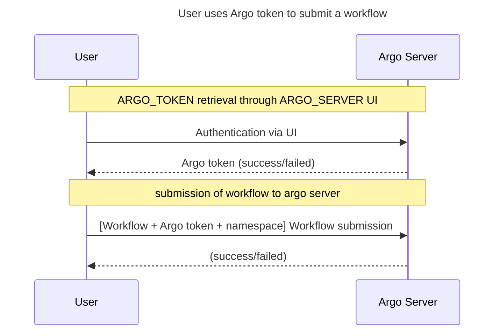
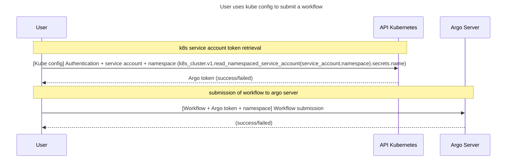
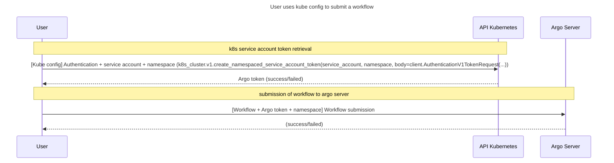
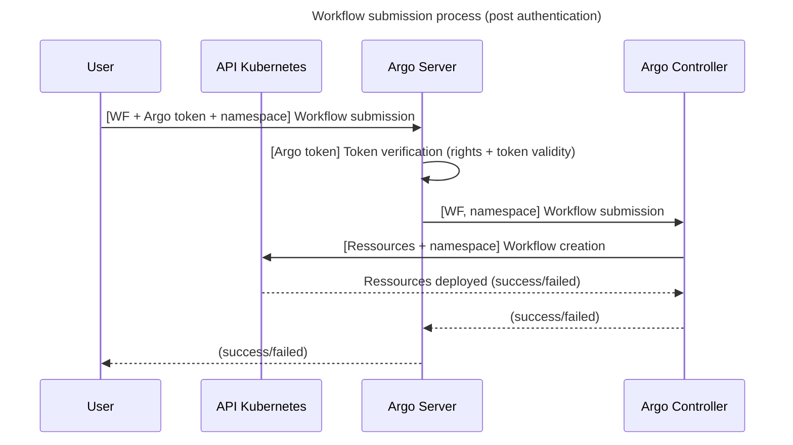

# Some (probably deprecated) notes on Hera authentication process

As recalled by the [Hera authentication documentation](https://hera.readthedocs.io/en/stable/walk-through/authentication/)
`the way you authenticate generally depends on your unique organization setup.`

## Argo server (direct) authentication handling

In this authentication setup, the user has to know and provide an `ARGO_SERVER` token.
For this the user might retrieve his `ARGO_SERVER` token through the ARGO UI.
The corresponding authentication sequence diagram goes

## Authentication through a k8s service account's token secret (requires k8s authentication)

Notes:

- A service account token and `ARGO_TOKEN` are of different nature since they do _not_ provide access to the same service. 
  A service account token seem to provide access to the argo-server at the k8s level.
  Whereas an `ARGO_TOKEN` provides access to the Argo Server API.
  Both tokens also different by their format (an `ARGO_TOKEN` is prefixed with the `Bearer v2:` string)
- This method is [not recommended since Kubernetes version 1.24](https://kubernetes.io/docs/concepts/security/service-accounts/#get-a-token)
  and token creation became restricted to manual mode starting from Kubernetes version 1.27.
In this authentication mode the `ARGO_TOKEN` is setup by the cluster admin and stored as a secret within a k8s service account. 
It is the user's responsibility to retrieve this token through the usage of k8s API which imposes k8s access/authentication
(basically a `KUBECONFIG` file).
The sequence diagram is very similar to the above one except for the first stage of token retrieval.

References: for an Hera example refer to [this k8s_api.py example](https://github.com/argoproj-labs/hera/blob/39f685a382cfa9f2ce2a8c77657960748502fbe6/examples/k8s_sa.py#L39C9-L39C43).

## Generating an Argo Token out of a k8s service account (requires k8s authentication)

In this authentication mode the user asks the k8s cluster to generated an `ARGO_TOKEN`.
Again, the usage of k8s API imposes k8s access/authentication (basically a `KUBECONFIG` file).
The sequence diagram is almost identical to the above one except for the method used within the k8s API.

https://argo-workflows.readthedocs.io/en/latest/managed-namespace/

## Notes concerning ArgoServer vs ArgoController vs KubeAPI

The sequence diagram goes

